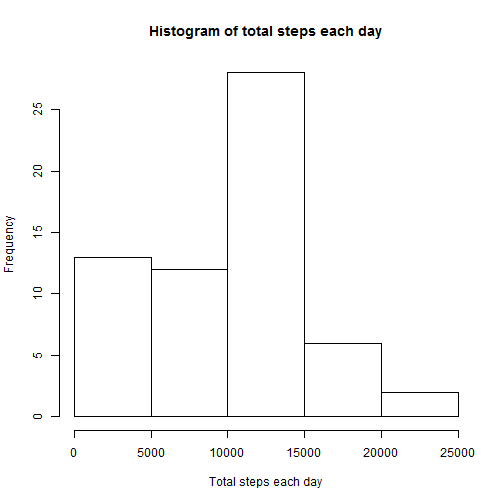
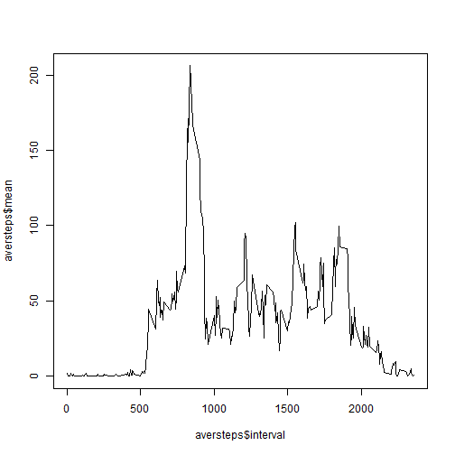

# Reproducible Reasearch: Peer Assessment 1

## Loading and preprocessing the data

Reading the file from the working directory

```r
activity<-read.csv("activity.csv", header=T)
```

Getting the total number of steps taken each day and then showing a histogram of the total number of steps each day.
Also, the mean and median of the total number of steps each day is calculated


```r
Sys.setlocale() 
```

```
## [1] "LC_COLLATE=English_United States.1252;LC_CTYPE=English_United States.1252;LC_MONETARY=English_United States.1252;LC_NUMERIC=C;LC_TIME=English_United States.1252"
```

```r
#install.packages("plyr") # in case not yet installed
library(plyr)
 stepstotal <- ddply(activity, c("date"), summarise, total = sum(steps[!is.na(steps)]), mean = mean(steps, na.rm=TRUE) )
hist(stepstotal$total, main="Histogram of total steps each day", xlab="Total steps each day")
```

 

```r
mean(stepstotal$total)
```

```
## [1] 9354.23
```

```r
median(stepstotal$total)
```

```
## [1] 10395
```
Making a time series plot (i.e. type = "l") of the 5-minute interval (x-axis) and the average number of steps taken, averaged across all days (y-axis)

Determining which 5-minute interval, on average across all the days in the dataset, contains the maximum number of steps

```r
aversteps <- ddply(activity, c("interval"), summarise,  mean = mean(steps, na.rm=TRUE) )
plot(aversteps$interval, aversteps$mean, type="l")
```

 

```r
which.max(aversteps$mean)
```

```
## [1] 104
```
Calculate and report the total number of missing values in the dataset (i.e. the total number of rows with NAs)

```r
sum(is.na(activity$steps))  # number of rows with NA
```

```
## [1] 2304
```
Using  strategy for filling in all of the missing values in the dataset. The mean for that 5-minute interval is used.
And creating a new dataset that is equal to the original dataset but with the missing data filled in.

```r
# install.packages("dplyr")  # in case this package is not installed

library("dplyr")

# impactivity has missing data filled
impactivity<-activity%>%group_by(interval)%>%mutate(steps = replace(steps, is.na(steps), mean(steps, na.rm=TRUE)))
```
Make a histogram of the total number of steps taken each day and Calculate and report the mean and median total number of steps taken per day. After filling the missing values,  the mean and the median are the same.

```r
impstepstotal<-ddply(impactivity, c("date"), summarise, total = sum(steps[!is.na(steps)]), mean = mean(steps, na.rm=TRUE) )
hist(impstepstotal$total, main="Histogram of total number of steps taken each day", xlab="Total number of steps taken each day")
```

 

```r
 mean(impstepstotal$total)
```

```
## [1] 10766.19
```

```r
 median(impstepstotal$total)
```

```
## [1] 10766.19
```
Create a new factor variable in the dataset with two levels - "weekday" and "weekend" indicating whether a given date is a weekday or weekend day.

```r
# weekdays and weekend
impactivity$daytype<-ifelse(!weekdays(as.Date(impactivity$date)) %in% c("Saturday", "Sunday"),"weekday","weekend")
```

Make a panel plot containing a time series plot (i.e. type = "l") of the 5-minute interval (x-axis) and the average number of steps taken, averaged across all weekday days or weekend days (y-axis).


```r
wkdact<-impactivity[impactivity$daytype=='weekday',]
wkdaversteps<-ddply(wkdact, c("interval"), summarise,  mean = mean(steps, na.rm=TRUE) )
 

wkenddact<-impactivity[impactivity$daytype=='weekend',]
wkendaversteps<-ddply(wkenddact, c("interval"), summarise,  mean = mean(steps, na.rm=TRUE) )
par(mfrow=c(2,1))
plot(wkdaversteps$interval, wkdaversteps$mean, main="Average number of steps on weekdays" , xlab="Interval",ylab="mean",type="l")
plot(wkendaversteps$interval, wkendaversteps$mean, main="Average number of steps on weekend" , xlab="Interval",ylab="mean" ,type="l")
```

 


